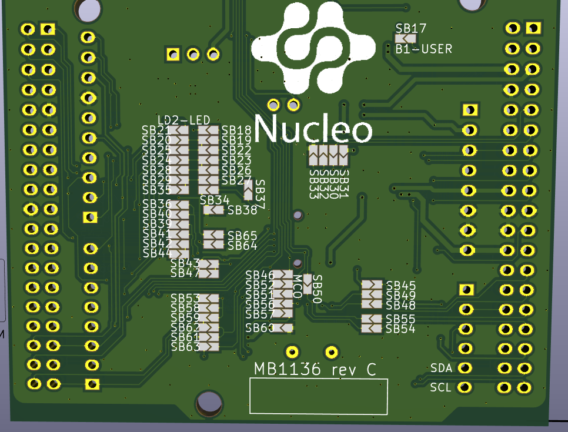

# Dev Board: NUCLEO-F411RE

[Official Website](https://www.st.com/en/evaluation-tools/nucleo-f411re.html)

This board is based on the **STM32F411** MCU. It is split into two sections: the **ST-LINK Programmer** and the **MCU board** itself. The programmer features a Mini-USB connector for PC connectivity; however, this USB connection is not shared with the MCU.

* **MCU:** STM32F411
* **Logic Level:** 3.3V

## Pinout

[Mbed OS - Nucleo F411RE Pinout](https://os.mbed.com/platforms/st-nucleo-f411re/#arduino-compatible-headers)

---

## Jumpers

The board features a variety of solder bridges (jumpers) on the bottom side. Each has a specific function; some are used to configure the board for different MCUs, and an incorrect selection could potentially damage the hardware.

For this project, the focus was on:

* **SB17:** Connects **PC13** to the User Button. This was disconnected to prevent interference with the project.
* **SB21:** Connects the User LED to **PA5 (D13)**.
* **SB79 & SB48:** These disconnect **PC14** and **PC15** from the external headers. These two pins are typically used for the (currently unpopulated) **X3** crystal oscillator.

For a full list of functions, refer to the [Schematic](./images/mb1136-default-c03_schematic.pdf).

### Jumper Configuration Changes

| Jumper | Closed | Function | Comment |
| --- | --- | --- | --- |
| **SB17** | No | PC13 → User BTN | Disconnects the User Button |
| **SB21** | No | D13 → User LED | Disconnects the User LED |
| **SB49** | Yes | PC14 → CN7.25 | Routes PC14 to the header pin |
| **SB48** | Yes | PC15 → CN7.27 | Routes PC15 to the header pin |
