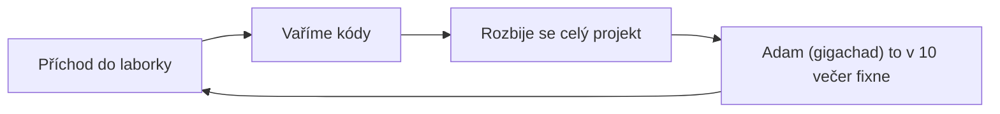
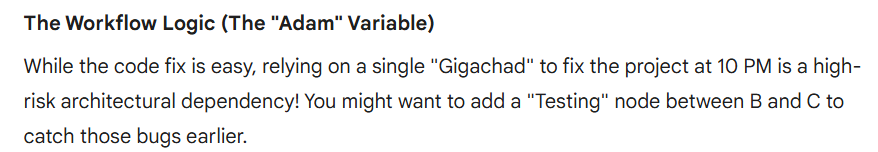

# ICUAS 2026 :skull:

??? abstract "Tato page je pouze vtip (možná)"
    Nic na této page neberte vážně (pokud nejste Frano Petric)


## CodeBase

!!! info "Sample kódu"
    Asi takto vypadá celá codebase spolku DRC v soutěži ICUAS(S) 2026

    === "Python"
        ```py linenums="1"
        icuas = "icuass" # Takhle to celý bylo
        ```

    === "C++"
        ```C linenums="1"
        #include <string>
        auto icuas = "icuass"; // A takhle nějak by to vypadalo v C++
        ```

## Everyday ICUAS workflow




## Gemini quote



